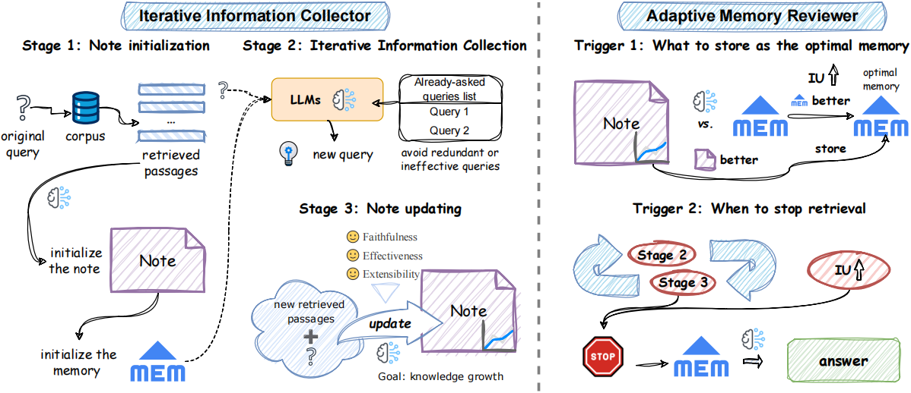

<h1 align="center">
    Retriever-and-Memory: Towards Adaptive Note-Enhanced Retrieval-Augmented Generation
</h1>


<div align="center">

[](https://www.python.org/downloads/release/python-3109/)
[](https://arxiv.org/abs/2410.08821)

</div>

We propose a generic RAG approach called Adaptive Note-
Enhanced RAG (Adaptive-Note) for complex QA tasks,
which includes the iterative information collector, adaptive
memory reviewer, and task-oriented generator, while fol-
lowing a new Retriever-and-Memory paradigm. 



# Prepare Datasets

Please create a `data/` directory and place all the corpus and evaluation files within it. All experimental datasets can be found [here](https://drive.google.com/drive/folders/11EGpumXoMVpnBsiR5xeLGDD3Z8ikBdVT?usp=drive_link). For the ASQA corpus, please download it separately from [this link](https://dl.fbaipublicfiles.com/dpr/wikipedia_split/psgs_w100.tsv.gz) due to its large size.

# Retrieval Services

We offer three retrieval services as detailed in our paper:

1. **BM25 Retrieval Service** using ElasticSearch for 2WikiMQA, MuSiQue, and HotpotQA.
2. **BGE Retrieval Service** using FAISS for CRUD.
3. **GTR Retrieval Service** using FAISS for ASQA.

## Prepare Services for BM25

First, install Elasticsearch 7.10 using the following commands:

```bash
wget https://artifacts.elastic.co/downloads/elasticsearch/elasticsearch-7.10.2-linux-x86_64.tar.gz
wget https://artifacts.elastic.co/downloads/elasticsearch/elasticsearch-7.10.2-linux-x86_64.tar.gz.sha512
shasum -a 512 -c elasticsearch-7.10.2-linux-x86_64.tar.gz.sha512
tar -xzf elasticsearch-7.10.2-linux-x86_64.tar.gz
cd elasticsearch-7.10.2/
./bin/elasticsearch # Start the server
pkill -f elasticsearch # To stop the server
```

## Indexing Corpora for the Datasets

### Build indices for 2WikiMQA, MuSiQue, and HotpotQA:

```bash
cd src/build_index/es

# 2WikiMQA
python index_2wiki.py

# MuSiQue
python index_musique.py

# HotpotQA
python index_hotpotqa.py
```

### ASQA Indexing

Our corpus and retrieval settings follow [ALCE](https://github.com/princeton-nlp/ALCE.git). Since generating GTR embeddings is resource-intensive, you can download them and place them in `data/corpus/asqa/` as follows:

```bash
wget https://huggingface.co/datasets/princeton-nlp/gtr-t5-xxl-wikipedia-psgs_w100-index/resolve/main/gtr_wikipedia_index.pkl
```

Build the index:
```bash
cd src/build_index/emb
python index.py --dataset asqa --model gtr-t5-xxl
```

### CRUD Indexing

Build the index for CRUD:
```bash
cd src/build_index/emb
python index.py --dataset crud --model bge-base-zh-v1.5 --chunk_size 512
```

# Configuration

You can configure your API key, URL, and other settings in the `./config/config.yaml` file.

# Running Note and Evaluation

To run and evaluate for 2WikiMQA, MuSiQue, HotpotQA, and ASQA:
```bash
python main.py --method note --retrieve_top_k 5 --dataset asqa --max_step 3 --max_fail_step 1 --MaxClients 10 --model gpt-3.5-turbo-0125 --device cuda:0 
```
The predicted results and evaluation metrics (F1 and EM) will be automatically saved in the `output/{dataset}/{method}/{model}` directory. The evaluation results can be found at the end of the file.

For CRUD (crud_1doc, crud_2doc, crud_3doc):
```bash
python main.py --method note --retrieve_top_k 2 --dataset crud_1doc --max_step 3 --max_fail_step 1 --MaxClients 10 --model gpt-3.5-turbo-0125 --device cuda:0 
```
The predicted results will be automatically saved in the `output/{dataset}/{method}/{model}` directory.

## Evaluating CRUD

We follow [CRUD-RAG](https://github.com/IAAR-Shanghai/CRUD_RAG.git) and use the RAGQuestEval metric, which relies on GPT. Run the following code to perform the evaluation:

```bash
python metrics_questeval_crud.py --eval_path {saved predict file}
```

The evaluation results will be automatically saved in the `output/{dataset}/{method}/{model}/metric_questeval` directory.


## Citation
Please cite the following paper if you find Adaptive-Note helpful!
```bibtex
@misc{wang2024retrieverandmemoryadaptivenoteenhancedretrievalaugmented,
      title={Retriever-and-Memory: Towards Adaptive Note-Enhanced Retrieval-Augmented Generation}, 
      author={Ruobing Wang and Daren Zha and Shi Yu and Qingfei Zhao and Yuxuan Chen and Yixuan Wang and Shuo Wang and Yukun Yan and Zhenghao Liu and Xu Han and Zhiyuan Liu and Maosong Sun},
      year={2024},
      eprint={2410.08821},
      archivePrefix={arXiv},
      primaryClass={cs.CL},
      url={https://arxiv.org/abs/2410.08821}, 
}
```


<p align="center">
<a href="https://star-history.com/#Significant-Gravitas/AutoGPT">
  <picture>
    <source media="(prefers-color-scheme: dark)" srcset="https://api.star-history.com/svg?repos=thunlp/Adaptive-Note&type=Date&theme=dark" />
    <source media="(prefers-color-scheme: light)" srcset="https://api.star-history.com/svg?repos=thunlp/Adaptive-Note&type=Date" />
    
  </picture>
</a>
</p>